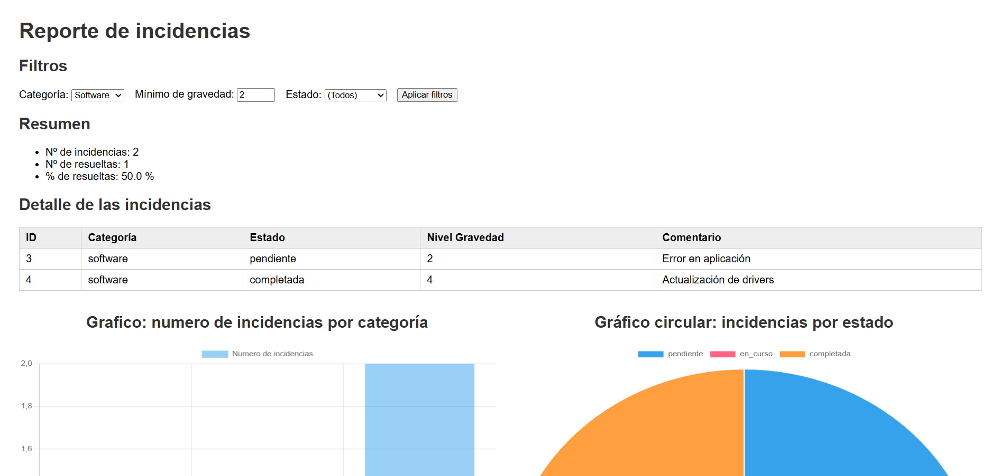
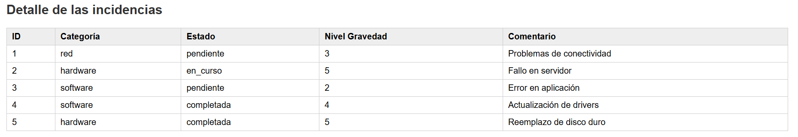
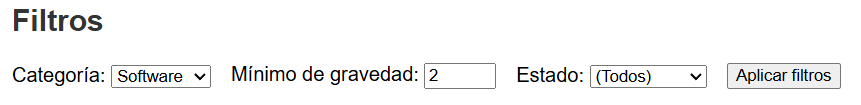
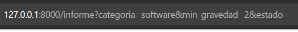
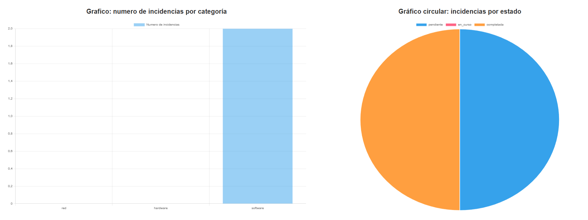

# Informe web de incidencias – FastAPI + Jinja2

Aplicación web desarrollada con FastAPI y Jinja2 que genera un informe dinámico de incidencias, permitiendo filtrar los datos y visualizar estadísticas mediante gráficos.



## 🚀 Tecnologías utilizadas

- Python
- FastAPI
- Jinja2
- Chart.js
- HTML / CSS

## 📄 Funcionalidad

La aplicación ofrece un informe accesible desde la ruta `/informe` que incluye:

- Filtros por categoría, gravedad mínima y estado.
- Resumen estadístico de incidencias.
- Tabla detallada de incidencias filtradas.
- Gráficos interactivos con Chart.js.

## 📋 Tabla de incidencias



## 🔎 Filtros disponibles

- **Categoría**: red, hardware o software.
- **Gravedad mínima**: valor entre 1 y 5.
- **Estado**: pendiente, en curso o completada.



Los filtros se aplican mediante parámetros en la URL.



## 📊 Gráficos

- Gráfico de barras con incidencias por categoría.
- Gráfico circular con incidencias por estado (mejora añadida).



## 🗂️ Estructura del proyecto

```text
.
├── main.py
├── templates/
│   ├── base.html
│   └── informe.html
├── capturas/
└── README.md
```

## ▶️ Ejecución

Ejecutar el servidor de desarrollo:

```bash
uvicorn main:app --reload
```

Acceder al informe desde el navegador:

http://127.0.0.1:8000/informe
